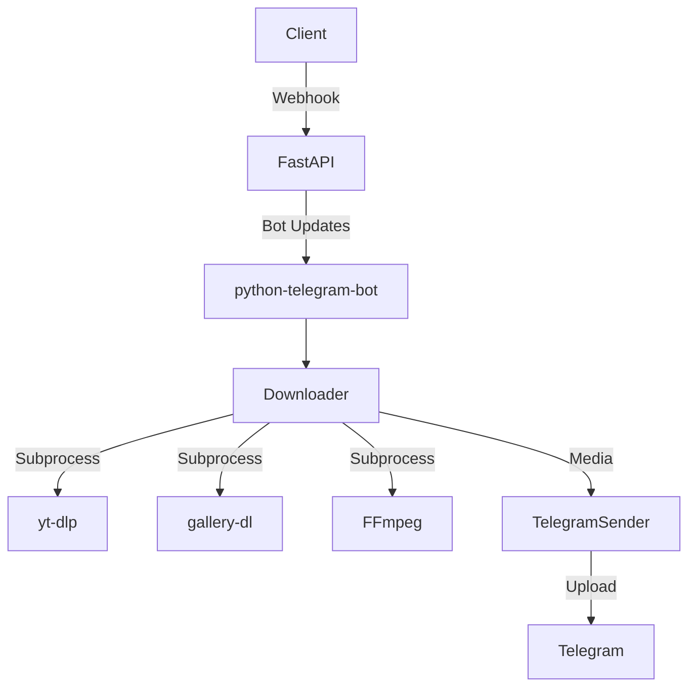

# SyncWatch (YTDL Bot)

A high-performance asynchronous Telegram bot built with FastAPI and `python-telegram-bot` for downloading media from popular platforms (YouTube, TikTok, Pinterest, VK, etc.) using `yt-dlp` and `gallery-dl`.

## What It Does

The bot processes user-provided media URLs and provides a direct HTTP download link, a native Telegram media upload, or converts standard video formats into a playable GIF seamlessly. It also supports extracting TikTok slideshows as image albums or compiling them into MP4 videos on the fly.

## Current Status

**Production-ish**. The project has a solid test suite (>430 tests), CI pipelines via GitHub Actions, structured metrics, caching, and multi-process handling in a Dockerized environment.
_Note: Support for live streams is explicitly omitted._

## Features

- **Multi-Platform Support**: YouTube, TikTok (no watermark), Pinterest, VK, Facebook, RuTube via `yt-dlp`.
- **Slideshow Processing**: Extracts images/audio from TikTok via `gallery-dl` and delivers them as a MediaGroup album (up to 10 photos) or converts them to an MP4 slideshow via `ffmpeg`.
- **Quality Selection**: Private chat offers dynamic interactive keyboards for quality selection (res, audio, video).
- **Group Mode**: Automatically downloads the optimal video format (<45MB) to ensure group chat friendliness.
- **GIF Conversion**: Single-click conversion of MP4 videos to GIF via `ffmpeg` directly in the chat.
- **Async & Observability**: Powered by `asyncio`, with internal Promotheus-compatible `/metrics` endpoint and structured JSON logging.
- **Rate Limiting**: Defended by token bucket rules (IP, User, Chat, Token).

## Non-Goals / Limitations

- **Live Streams**: Deliberately disabled (`LiveStreamError` is gracefully handled).
- **Infinite File Sizes**: Strict constraints for direct HTTP downloads (`MAX_DL_MB=1000`) and Telegram uploads (`MAX_TG_UPLOAD_MB=45`).
- **Distributed Caching**: Primarily relies on local in-memory TTLCache. Not configured for Redis/Memcached.
- **Persistent Storage**: Media files exist only temporarily in `TMPDIR` and are swept by a janitor task.

## Architecture

- **Web Layer**: FastAPI serves `/health`, `/metrics`, HTTP downloads (`/dl/{token}`), and the Telegram `/webhook`.
- **Bot Engine**: `python-telegram-bot` handles UI callbacks, format pickers, and sending data to users.
- **Core Services**: Orchestrates extraction (`yt-dlp`), batch imaging (`gallery-dl`), fallback logic (`tikwm.py` via `curl_cffi`), and media processing (`ffmpeg`).
- **Data Flow**: URL -> Bot -> `ytdlp` -> Extracted Info -> Cached locally. On user choice -> `ytdlp` subprocess downloads to `TMPDIR` -> Sent via `TelegramSender` -> Cleaned up by Janitor.



## Repository Structure

| Path            | Purpose                                                                       |
| --------------- | ----------------------------------------------------------------------------- |
| `app/api/`      | FastAPI endpoints (`/health`, `/metrics`, `/dl/{token}`, `/webhook`).         |
| `app/bot/`      | Telegram handlers, commands, callbacks, UI texts, and keyboards.              |
| `app/core/`     | Global state, rate limiting, logging, metrics, config, process supervision.   |
| `app/services/` | Wrappers for `yt-dlp`, `gallery-dl`, media processing, and sender logic.      |
| `app/tasks/`    | Background task loop (`janitor.py` for temp dir cleanup).                     |
| `tests/`        | Pytest suite: Unit, integration, property-based (Hypothesis), security tests. |
| `Dockerfile`    | Multi-stage image build for deploying the bot.                                |

## Tech Stack

| Layer                      | Technology                 | Purpose                                                             |
| -------------------------- | -------------------------- | ------------------------------------------------------------------- |
| **Web Server**             | FastAPI / Uvicorn          | Routing HTTP downloads, webhooks, health checks.                    |
| **Bot Framework**          | python-telegram-bot        | Asynchronous bot handling (`Application.builder()`).                |
| **Extraction Executables** | yt-dlp, gallery-dl         | Heavy-lifting parsing and media fetching.                           |
| **Browser Faking**         | curl_cffi                  | Used as fallback TLS-fingerprint simulator for TikTok (`tikwm.py`). |
| **Processing Executable**  | FFmpeg                     | Direct video streaming, slideshow conversion, and GIF creation.     |
| **Testing**                | pytest, hypothesis, mutmut | Test automation, fuzzing inputs, and mutation coverage.             |

## Setup

### Prerequisites

- Python 3.12+
- FFmpeg (Must be in `PATH`)
- `yt-dlp` and `gallery-dl`
- Deno (Required for yt-dlp's YouTube parameter challenges. See `Known Documentation Gaps`)
- aria2 (Optional, but used in Docker for faster fragmented downloads)

### Step-by-Step

1. Clone the repository: `git clone <repo>`
2. Create and activate a Virtual Environment: `python -m venv venv && source venv/bin/activate`
3. Install dependencies: `pip install -r requirements.txt`
4. Copy env file: `cp .env.example .env`
5. Configure `.env` (`BOT_TOKEN` is mandatory).

## Configuration

| Variable                     | Required | Default                 | Description                                              | Used In                          |
| ---------------------------- | -------- | ----------------------- | -------------------------------------------------------- | -------------------------------- |
| `BOT_TOKEN`                  | **Yes**  | —                       | Telegram Bot setup token                                 | `app.main`                       |
| `BASE_URL`                   | No       | `http://localhost:8000` | Used for generating HTTP direct download links           | `app/bot/callbacks.py`           |
| `WEBHOOK_URL`                | No       | —                       | If set, bot relies on webhook. If empty, uses polling.   | `app.main`                       |
| `TELEGRAM_SECRET_TOKEN`      | No       | _Randomly Generated_    | Webhook authentication header check                      | `app/api/routes.py`              |
| `TMPDIR`                     | No       | System Temp             | Root directory for all transient media files             | `app/core/config.py`             |
| `MAX_TG_UPLOAD_MB`           | No       | `45`                    | Limit for Telegram uploads in MB                         | `app/bot/callbacks.py`           |
| `MAX_DL_MB`                  | No       | `1000`                  | HTTP direct download maximum limit in MB                 | `app/api/routes.py`              |
| `MAX_CONCURRENT_TASKS`       | No       | `5`                     | Semaphores controlling bot thread concurrency            | `app/core/state.py`              |
| `YTDLP_CONCURRENT_FRAGMENTS` | No       | `8`                     | Parallel fragment downloads parameter in yt-dlp          | `app/services/ytdlp/builders.py` |
| `TIKTOK_PROXY`               | No       | —                       | SOCKS5 Proxy config specific for bypassing TikTok blocks | `app/services/tikwm.py`          |

_(Refer to `.env.example` for all detailed variables including Rate Limiters and Cookies)._

## Run

### Locally (Polling or Webhook)

```bash
uvicorn app.main:api --reload
```

### Docker

```bash
docker build -t ytdlbot .
docker run -d --name ytdlbot -p 8000:8000 -e BOT_TOKEN=YOUR_TOKEN ytdlbot
```

## Scripts

| Command                 | Purpose                               |
| ----------------------- | ------------------------------------- |
| `pre-commit install`    | Installs Git hooks for safety checks. |
| `ruff check .`          | Linting codebase errors.              |
| `ruff format --check .` | Verifying formatting.                 |
| `python -m mypy app/`   | Strict Type checking.                 |

## Testing

- **Unit & Property Tests**: Standard offline tests and hypothesis fuzzers.
- **Integration Tests**: Reaches out via `yt-dlp` and `ffmpeg` externally.
- **Tooling**: `pytest`, `pytest-cov`, `hypothesis`, `mutmut`.
- **Prerequisites**: Functional ffmpeg/yt-dlp installed if running the `integration` mark.

| Test Type            | Tooling | Command                                           | Scope                                                                    |
| -------------------- | ------- | ------------------------------------------------- | ------------------------------------------------------------------------ |
| Fast Unit/Mock Tests | pytest  | `pytest tests/ --cov=app -q -m 'not integration'` | Excludes live binary execution. Focuses on logic and routing boundaries. |
| Integration Tests    | pytest  | `pytest -m integration`                           | Executes yt-dlp to assert external format extraction capabilities.       |
| Full Suite Coverage  | pytest  | `BOT_TOKEN=test pytest tests/ -v`                 | Complete execution across the board.                                     |

## API / Events / Contracts

- **HTTP Routes**:
  - `GET /health` -> System ready-check `{"ok": True}`.
  - `GET /metrics` -> Returns Prometheus text format counters/timers.
  - `GET /dl/{token}` -> Direct HTTP stream pipe via `StreamingResponse` (mp3/mp4).
  - `POST /webhook` -> Telegram Webhook handler endpoint expecting `X-Telegram-Bot-Api-Secret-Token`.
- **Main Telegram Events**:
  - Text triggers `app.bot.messages.on_message` (Parses URL context).
  - Callback Queries route to specific function commands dynamically (`pick|{token}`, `cancel|{token}`, `send|{token}`, `gif|{token}`).
- **Payloads**: The `info_cache` passes JSON parameters from `yt-dlp` internally bridging processes logic.

## Main User Flows

### 1. Simple Video Download (Private Chat)

- **Preconditions**: Bot running, valid URL.
- **Steps**: User sends URL -> Bot validates and launches `yt-dlp --dump-json` -> Keyboard prompts quality options -> User picks option -> Video is downloaded incrementally and `TelegramSender` dispatches to user.
- **Expected Outcome**: Final MP4/MP3 arrives in chat. Temporary payload cleared from `TMPDIR`.

### 2. GIF Auto-Conversion (Group Chat)

- **Preconditions**: User previously requested video in Group (bot uploaded < 45MB format natively).
- **Steps**: User clicks `Send GIF` attached on bot video reply -> Bot queries `file_cache` -> Strips audio tracks using `ffmpeg` memory copy -> Responds natively bypassing new HTTP calls.
- **Expected Outcome**: Accelerated GIF presentation linked synchronously to parent video reply.

### 3. TikTok Slideshow

- **Preconditions**: User sends a multi-page TikTok post URL.
- **Steps**: Bot identifies `is_slideshow=True` via custom parsers -> Asks for "Photo Album" (Send MediaGroup arrays) or "Video" -> Fetches images with `gallery-dl` -> Optionally transcodes frames with mp3 backdrop in `ffmpeg` -> Uploads.
- **Expected Outcome**: Visually dense MediaGroup or generated MP4 file arrives inside Telegram UI cleanly.

## Troubleshooting

- **No Upload Button Working**: Ensure `ENABLE_TELEGRAM_UPLOAD` is `1`. Limit checking stops large loads instantly.
- **URL Timeout**: TikTok occasionally bans unproxied datacenters. Fix by deploying `TIKTOK_COOKIES_B64` or `TIKTOK_PROXY` globally.
- **Missing FFMPEG Error**: `ffmpeg` binary dictates almost everything under the hood (GIF converter, TikTok streams); make sure it evaluates fine globally via `$PATH`.
- **Zombie Process Spillage**: High memory? Docker handles Process Groups inherently for ungraceful exits, but in local polling verify `janitor.py` intervals (`JANITOR_INTERVAL_SECONDS`).

## Known Documentation Gaps

1. **Deno Dependency Mapping**: `Deno` is structurally required by the `Dockerfile` to circumvent recent YouTube `n-parameter` token obfuscations within `yt-dlp`, but it isn't listed among standard Local Dev "Prerequisites" initially.
2. **Concurrency Mismatches**: Local `.env.example` documents `MAX_CONCURRENT_TASKS` default as `2`, yet `app/core/config.py` enforces it natively at `5`.
3. **Metrics Endpoint Unlisted**: Real-time observability tracking (via `/metrics`) is fully configured but wasn't clearly indicated on initial endpoint guides.
4. **Mutation Testing Local Use**: Although `pyproject.toml` references `mutmut` directly alongside tests, GitHub CI documentation lacks explicit developer commands to manually orchestrate those tasks locally.

## Contributing

- Target branch for fixes is typically `main` unless stated otherwise.
- Format code before submitting: Execute `ruff format --check .` and `python -m mypy app/`.
- Verify coverage boundaries (`75%` baseline) holding ground post-PR with `pytest`.

## License

**MIT License** (Based on `README.md` and repository standards. Subject to root `LICENSE` if present).
