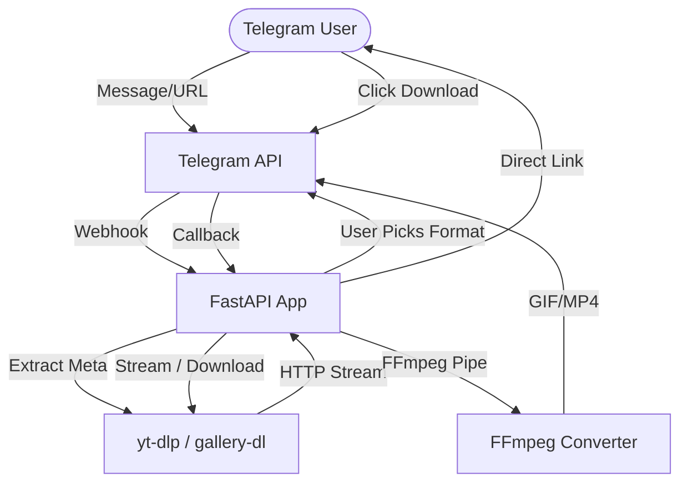

# YTDL Bot - Telegram Media Downloader

A high-performance Telegram bot for downloading media from popular platforms (YouTube, TikTok, Pinterest, VK, etc.) using `yt-dlp` and `gallery-dl`. Built with **FastAPI**, **python-telegram-bot**, and **asyncio** for maximum concurrency, offering direct downloads, smart caching, and on-the-fly media conversion.

## What It Does

YTDL Bot solves the problem of friction in downloading and sharing media from social networks. Instead of using third-party websites loaded with ads, users can interact with this Telegram bot to directly download videos, audio, and TikTok image carousels. It handles extraction, conversion, size limitations, and streaming (both direct link and Telegram upload) automatically in the background.

## Current Status

**Production-ish / API-Stabilized**
The project is well-structured and highly tested (>533 tests, CI/CD pipeline). However, since it relies heavily on third-party extraction tools (`yt-dlp`, `gallery-dl`) and platform algorithms, it is inherently subject to platform-side changes (e.g., rate limits, blockages).
Recent systemic fixes have stabilized asynchronous subprocess extraction and decoupled Redis caching dependencies, making the pipeline heavily resilient to coroutine clashes. Some advanced evasion techniques (proxies, cookies) are configured but require manual upkeep by the admin.

## Features

- **Multi-Platform Support**: Extracts video/audio from YouTube, X (Twitter) via ultra-fast native API bypassing yt-dlp blocks, TikTok (watermark-free via TikWM API with zero-latency BVC2 codec interception and robust geo-block yt-dlp fallback), Pinterest (native 200ms open-graph parsing), Instagram (stories, highlights, posts/reels with resilient hybrid Mobile API fallback, automatic session eviction, and CSRF retry), VK, Facebook, and RuTube.
- **Smart Group Mode**: Automatically selects and downloads the best quality video (<45MB by default) when a link is sent in a group chat.
- **Interactive Private Mode**: Presents inline keyboard options for users to select specific video qualities or audio-only formats.
- **TikTok Slideshow Support**: Converts TikTok carousels natively via TikWM API into either a 📸 Photo Album (media group) or a 🎬 Video Slideshow (MP4 with audio) using `ffmpeg`.
- **Strict Format Binding**: Guaranteed zero-mismatch downloads across platforms. Parses formats early to skip FFmpeg muxing (pre-mux priority), conserving resources and preventing Telegram size-limit errors.
- **Fast-Path Media Pipeline (Zero-CPU/Zero-Disk)**: Five complementary optimizations minimize server load and latency:
  - **OPT-1 Zero-Cost Thumbnails**: `yt-dlp --write-thumbnail` writes `.jpg` previews alongside every video; the bot injects them into `send_video` at zero extra cost.
  - **OPT-2 Stream-Copy Splitting**: Files > 48.5 MB are split into Telegram-compatible chunks via `ffmpeg -c copy` (zero re-encoding, ~1–3 s per 200 MB). Skips two-pass compression when possible.
  - **OPT-3 Native Opus Bypass**: WebM files containing Opus audio are renamed to `.ogg` with no FFmpeg transcoding, enabling native `send_audio` delivery.
  - **OPT-4 Cobalt Direct URL Delivery**: For TikTok/Twitter files ≤ 19.5 MB, a `HEAD` request reads `Content-Length`; if within Telegram's URL-fetch limit the CDN URL is passed directly—our server never touches the bytes.
  - **OPT-5 Timestamp Slicing Engine**: URL-based video clipping (`url 01:10-01:25`) via `--download-sections`. Server-side execution restricts fetched data strictly to the needed segment.
  - **OPT-6 Strict CDN Downscaling**: Configures `[filesize<?50M]` filtering rules. Strictly delegates multi-resolution processing upstream, preventing severe localized CPU bottlenecks from ffmpeg downscaling workloads.
- **Resource Efficient & Clean UX**: Progress thresholds (10%, 25%, 50%, 75%, 90%) parsing realtime `stderr` to limit Telegram API notification spam. Enables native cancellation mechanisms natively hooked into subprocess lifecycle. Silent payload delivery for sprawling media groups (10+ images albums).
- **Smart Video Target Compression**: Automatically intercepts oversized videos before Telegram limits reject them. Implements a mathematically precise two-pass `libx264` scaling down to exact 48.5MB targets, protecting long/high-bitrate videos from `413 Request Entity Too Large` Bot API errors.
- **Local Bot API Integration**: Automatically detects and leverages `TELEGRAM_LOCAL_ENDPOINT` to completely disable CPU-heavy compression. Seamlessly proxies files up to **2000 MB (2 GB)** over the internal network via HTTP chunked streaming directly to your Local Bot API server. Eliminates the need for complex shared persistent volumes (PVs).
- **Optimized Download Pipeline**: Passes metadata to bypass duplicate `yt-dlp` extraction calls, and supports direct pipe-to-memory streaming for videos <50MB, saving disk I/O.
- **Zero-Disk Pipeline**: Converts video to GIF natively without saving intermediary files to disk (`yt-dlp` → `ffmpeg` pipe).
- **Native `.gif` File Export**: On-demand two-pass FFmpeg palette generation (`palettegen`→`paletteuse`) for full `GIF89a`-spec files (480px/15fps, Bayer dithering). Sent via `sendDocument` so users receive a real `.gif` that works in Discord, phone galleries, and local media players — not an MP4 in disguise.
- **Autonomous `yt-dlp` Auto-Updater**: Background task runs `yt-dlp -U` every 24 h (configurable via `YTDLP_UPDATE_INTERVAL_HOURS`), logging version transitions and incrementing a Prometheus counter.
- **Reply-to URL Resolution**: All handlers fall back to the replied-to message when the primary message contains no supported URL — works naturally in group chats.
- **Fast-Path Slash Commands**: `/mp3 <url>` and `/mp4 <url>` bypass the format picker and deliver audio/video directly. Both accept reply-to messages containing the URL.
- **Per-User Download Preferences**: Users can persist their preferred format and quality via `/setformat`, `/setquality`, and `/settings`. Preferences are stored in Redis with a 90-day TTL and automatically applied on every subsequent link.
- **Adaptive Tiered Concurrency with Fair Queue**: Two purpose-built semaphores — `api_sem` (high-capacity, for TikWM/Cobalt/Pinterest) and `download_sem` (for yt-dlp/ffmpeg) — now backed by a position-aware `DownloadQueue`. When all slots are busy, users are queued fairly and receive live position updates (`"⏳ Вы #3 в очереди (~45 сек)"`) instead of a hard rejection. A configurable hard cap (`MAX_QUEUE_SIZE`, default 15) still applies for true overload scenarios.
- **Proactive Disk Protection**: The janitor monitors free disk space every cycle. At ≤15% free it sends an admin alert; at ≤5% it triggers an aggressive purge of all cached files, activates maintenance mode (new downloads rejected with a user-friendly message), and notifies the admin via Telegram. Maintenance mode auto-clears once disk recovers above the warning threshold.
- **Rate Limiting**: Multi-layered token bucket limiter preventing abuse per User, Chat, IP, and Token.
- **Monitoring, Logging & Admin Reporting**: Built-in Prometheus-compatible metrics endpoint (`/metrics`) exposing operational telemetry. Fully structured logging across the pipeline. Global error handler sends formatted exception reports (traceback, user/chat context) directly to `ADMIN_CHAT_ID` via Telegram.

## Non-Goals / Limitations

- Exceeding Telegram's hard 50MB bot upload limit is restricted by default (downloads >45MB are compressed or aborted). However, configuring a `TELEGRAM_LOCAL_ENDPOINT` seamlessly bypasses this limit, theoretically expanding upload capacity to **2000 MB (2 GB)**. *Note: Actual limit heavily depends on the ephemeral storage capacity of your host (e.g., Northflank free tier limits temp disk to 1GB, capping max files at ~900MB).*
- Direct age-restricted or pure-private content downloads might fail unless `*_COOKIES_B64` variables are manually configured and refreshed by the server admin.
- The bot is not a permanent file host. HTTP direct download links expire based on `LINK_TTL_MINUTES`.

## Architecture

- **Web Layer**: FastAPI serves HTTP endpoints (health checks, Prometheus metrics, and chunked video streams) and handles incoming Telegram Webhooks.
- **Telegram Logic**: `python-telegram-bot` processes updates concurrently (`concurrent_updates=True`). The webhook endpoint uses fire-and-forget `asyncio.create_task()` dispatch, returning HTTP 200 immediately to Telegram so update delivery is never blocked by slow handlers.
- **Orchestration Layer**: `DownloadOrchestrator` centralizes all download lifecycles, safely encapsulating complex rules like concurrency queues (`DownloadQueue` wrapping `asyncio.Semaphore`), file-size checks, and fallback mechanisms.
- **Data Fetchers**: `TikWMService` acts as the primary API for ultra-fast, watermark-free TikTok extraction. `YtDlpService` acts as the primary async CLI wrapper for YouTube and standard sites, while `GalleryDlService` and `CobaltService` (optional) handle deep fallback resolution.
- **Media Processing**: `FFmpeg` is utilized for post-processing tasks (GIF conversion, slideshow building, H.264 re-encoding for incompatible codecs). The Fast-Path pipeline actively avoids FFmpeg for compatible media.
- **State Management**: `RedisStorage` manages caching using blazing-fast `msgpack` serialization with `zlib` compression to minimize RAM overhead. `RedisTokenBucketLimiter` implements atomic Lua scripts for accurate, distributed rate limiting.



## Repository Structure

| Path            | Purpose                                                                    |
| --------------- | -------------------------------------------------------------------------- |
| `app/api/`      | FastAPI routes for Webhooks, `/health`, `/metrics`, and `/dl/{token}`.     |
| `app/bot/`      | Telegram bot command/message handlers and inline keyboards.                |
| `app/core/`     | Global config, rate limiter logic, caching, and state structures.          |
| `app/services/` | Wrappers for `yt-dlp`, `gallery-dl`, `ffmpeg` conversion, and downloading. |
| `app/tasks/`    | Background periodic tasks: `janitor.py` for temp cleanup + **proactive disk monitoring**, `auto_updater.py` for yt-dlp updates. |
| `tests/`        | 602+ Pytest tests covering unit, integration, and security.                |
| `Dockerfile`    | Multi-stage build definition for containerized deployment.                 |
| `scripts`       | Python standalone script for local debugging of `yt-dlp` extraction.       |

## Tech Stack

| Layer           | Technology          | Purpose                                              |
| --------------- | ------------------- | ---------------------------------------------------- |
| Web Framework   | FastAPI / Uvicorn   | Webhooks, streaming downloads, metrics               |
| Bot Framework   | python-telegram-bot | Telegram API interface and callback routing          |
| Extraction Core | yt-dlp / gallery-dl | Resolving platform links to raw media URLs           |
| Media Engine    | FFmpeg              | Splitting, GIF conversion, H.264 re-encode, merging  |
| Fingerprinting  | curl_cffi           | TLS impersonation (TikWM, Pinterest, Instagram paths) |

## Setup

1. **Clone Repo**:
   ```bash
   git clone https://github.com/yourusername/ytdlbot.git
   cd ytdlbot
   ```
2. **Setup Virtual Environment**:
   ```bash
   python -m venv venv
   source venv/bin/activate
   ```
3. **Install Requirements**: Ensure system `ffmpeg` is installed first.
   ```bash
   pip install -r requirements.txt
   ```
4. **Environment Configuration**:
   ```bash
   cp .env.example .env
   # Add your BOT_TOKEN to .env
   ```

## Configuration

Selected key variables from `.env.example`:

| Variable                | Required | Default                    | Description                                                                                 | Used In          |
| ----------------------- | -------- | -------------------------- | ------------------------------------------------------------------------------------------- | ---------------- |
| `BOT_TOKEN`             | **Yes**  | —                          | Telegram Bot Token from @BotFather                                                          | Core Bot Setup   |
| `BASE_URL`              | No       | `http://localhost:8000`    | External endpoint base for generated DL links                                               | HTTP API         |
| `WEBHOOK_URL`           | No       | —                          | If set, FastAPI acts as webhook. Else, polling                                              | Webhook setup    |
| `MAX_TG_UPLOAD_MB`      | No       | `45`                       | Maximum size for direct Telegram upload                                                     | Download Limiter |
| `LIMITER_USER_CAPACITY` | No       | `10`                       | Rate limit tokens per user                                                                  | Core Limiter     |
| `COBALT_API_URL`        | No       | `https://api.cobalt.tools` | Endpoint for the Cobalt extraction API (supports comma-separated list for fallback routing) | CobaltService    |
| `YOUTUBE_PIPE_MODE`     | No       | `false`                    | Opt-in direct piping to TG for YT videos <50MB                                              | Downloader       |
| `YTDLP_COOKIES_B64`       | No       | —                          | Base64-encoded Netscape cookies for Auth bypass                                             | `yt-dlp` Service |
| `IG_SESSIONS_B64`         | No       | —                          | Comma-separated Base64-encoded Instagram sessions for anti-ban rotation pool                | Instagram Service |
| `LIMITER_IG_CAPACITY`     | No       | `15`                       | Max hourly requests per Instagram session                                                   | Config Limiter   |
| `TELEGRAM_LOCAL_ENDPOINT` | No       | —                          | Internal HTTP URL to your local Telegram Bot API Server (e.g., `http://tg-api:8081`)        | Downloader / PTB |
| `YTDLP_UPDATE_INTERVAL_HOURS` | No   | `24`                       | Interval (hours) between autonomous `yt-dlp` self-updates                                  | Auto-Updater     |
| `MAX_API_TASKS`           | No       | `10`                       | Semaphore capacity for lightweight API-origin downloads (TikWM, Pinterest, Cobalt)          | Orchestrator     |
| `ADMIN_CHAT_ID`           | No       | —                          | Your Telegram user ID. Enables unhandled-exception reports and disk alerts to the admin     | Error Handler / Janitor |
| `MAX_QUEUE_SIZE`          | No       | `15`                       | Max requests that may wait in the download queue before being hard-rejected                 | DownloadQueue    |
| `QUEUE_TIMEOUT_SECONDS`   | No       | `300`                      | Max seconds a request may wait in queue before timing out                                   | DownloadQueue    |
| `DISK_WARNING_PCT`        | No       | `15`                       | Free-disk-space threshold (%) that triggers an admin warning alert                         | Janitor          |
| `DISK_CRITICAL_PCT`       | No       | `5`                        | Free-disk-space threshold (%) that triggers aggressive purge and maintenance mode           | Janitor          |

## Run

Run the bot natively using Uvicorn (uses Polling if `WEBHOOK_URL` is empty):

```bash
uvicorn app.main:api --reload
```

## Scripts

| Command          | Purpose                                                                                            |
| ---------------- | -------------------------------------------------------------------------------------------------- |
| `python scripts` | Standalone script for testing `yt-dlp` raw format extraction locally without running the full bot. |

## Testing

The project uses `pytest` heavily, along with `mutmut` for mutation testing and `hypothesis` for property-based tests. Test thresholds are strictly enforced via the CI pipeline (`.github/workflows/test.yml`).

| Test Type       | Tooling               | Command                                                                                          | Scope                                                                    |
| --------------- | --------------------- | ------------------------------------------------------------------------------------------------ | ------------------------------------------------------------------------ |
| **Unit**        | `pytest` + `coverage` | `python -m pytest tests/ --cov=app --cov-report=term-missing -v --tb=short -m "not integration"` | Tests core logic, mock external APIs, parsers. Fails under 75% coverage. |
| **Integration** | `pytest`              | `python -m pytest tests/test_integration_real.py -m integration --no-cov -v`                     | Requires real `yt-dlp` and `ffmpeg` binaries. Verifies real downloads.   |
| **Mutation**    | `mutmut`              | `mutmut run`                                                                                     | Mutates format parsing logic to check test robustness.                   |

_Prerequisites: System must have `ffmpeg` and local `python -m pytest` available._

## API / Events / Contracts

### HTTP Routes (FastAPI)

- `GET /health` : Liveness probe.
- `GET /metrics` : Prometheus-compatible metrics output.
- `GET /dl/{token}` : Streams media chunks directly to clients given a valid token payload.
- `POST /webhook` : Telegram Webhook destination. Validates `X-Telegram-Bot-Api-Secret-Token`.

### Telegram Commands (PTB)

- `/start` : Initializes bot, registers user intent, prints welcome menu.
- `/help` : Displays supported platforms and current size limit constants.

### Action Callbacks

- `^pick\|` : Quality format selected by user.
- `^cancel\|` : Task cancellation request.
- `^send\|` | `^gif\|` : Post-download interactive transforms.
- `^giffile\|` : On-demand native `.gif` file export (palettegen→paletteuse, sendDocument reply).
- `^slideshow\|` / `^grpslide\|` : Specific selectors for TikTok carousel behavior.

## Main User Flows

### Flow 1: Private Quality Selection

- **Preconditions**: User sends a valid supported link to the bot privately.
- **Steps**:
  1. Bot replies with "Processing..." and extracts formats.
  2. Bot presents inline keyboard with specific resolutions (e.g., 1080p, 720p) and sizes.
  3. User clicks an inline button.
- **Expected Outcome**: Bot downloads the requested track, uploads it back to Telegram, and removes its temporary files.

### Flow 2: Smart Group Mode

- **Preconditions**: Bot is added to a group with message read permissions, and someone posts a link.
- **Steps**:
  1. Bot intercepts the link and parses formats.
  2. Logic bypasses interactive keys, auto-selecting the best format below `MAX_TG_UPLOAD_MB`.
  3. Bot posts the video directly as a reply to the original message.
- **Expected Outcome**: Immediate, seamless media playback in group without menu spam.

### Flow 3: On-Demand Native GIF Export

- **Preconditions**: Bot has delivered a video with dual GIF format buttons (`🔄 Анимация (MP4)` and `💾 Файлом (.gif)`).
- **Steps**:
  1. User presses the `💾 Файлом (.gif)` button; bot answers with a Toast and updates the button to `⏳ Готовлю .gif файл...`.
  2. Handler checks Global Redis cache (`gifdoc:{hash(url)}`) — if a `file_id` is cached within the last 7 days, it re-sends instantly via `sendDocument`.
  3. If no cache hit: locates the source MP4 from `file_cache` (limited to 30 elements in `/tmp`). If evicted, it seamlessly re-fetches from Telegram using `bot.get_file(anim.file_id)` (Local API, zero external traffic).
  4. Defends against catastrophic CPU consumption by rejecting sources > 50MB. If source is already `.gif`, bypasses FFmpeg entirely.
  5. Computes native conversion via FFmpeg two-pass `palettegen` → `paletteuse` algorithm capped at 480px/15fps.
  6. Sends the output file via `sendDocument` and caches the file globally by URL hash.
- **Expected Outcome**: User receives a standards-compliant `.gif` file. Overheads are nullified for repetitive requests (same URL cross-user) through robust 7-day global caching and seamless UX recovery mechanisms for older sources.

## Troubleshooting

- **Large file fails to upload**: Verify `MAX_TG_UPLOAD_MB` is not set above Telegram's 50MB hard limit. The bot cleanly aborts uploads larger than this context.
- **429 Too Many Requests**: You hit the token bucket. Inspect `LIMITER_*` variables in `.env` if developing locally.
- **TikTok extraction fails / TikWM rate limits**: Usually caused by aggressive datacentre IP blocks, or exceeding the TikWM API limits free constraints (1 req/sec, enforced internally via a queue). Feed `TIKTOK_COOKIES_B64` or a residential `TIKTOK_PROXY` into the environment if you wish to fall back to `yt-dlp` extraction routes.

## Known Documentation Gaps

- **Script naming discrepancy**: Older documentation specifies a `scripts` folder containing CLI scripts, but the repo possesses a single `scripts` flat file containing python code used for debug purposes.
- **Property testing details**: The GitHub Actions integration testing workflow actually defaults to `mutmut run` succeeding loosely (`|| true`), indicating mutation metrics are likely informative, not strictly enforcing build failure at this time in the test suite.

## Contributing

1. Create feature branches (`feature/Name`).
2. Pass `pre-commit run --all-files` locally (which triggers `ruff`, `mypy`).
3. Ensure the unit test suite passes with `python -m pytest tests`.
4. Submit PRs against `main`. All CI checks must pass.

## License

Distributed under the MIT License.
