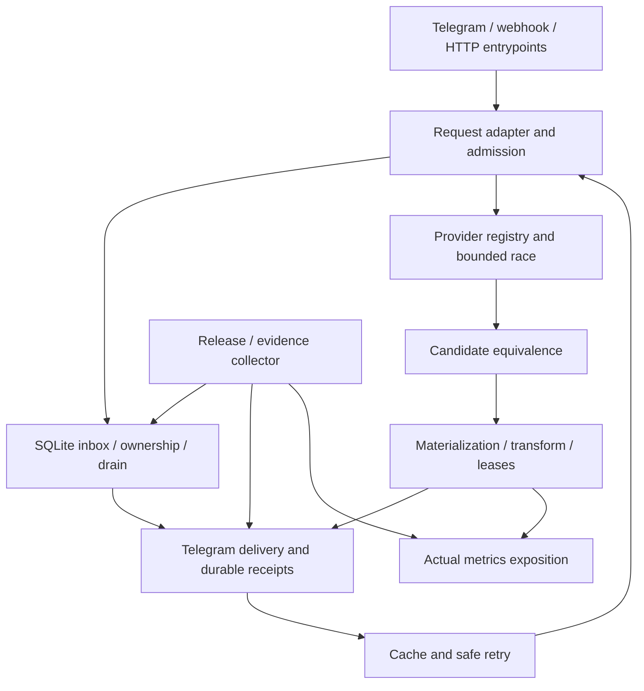

# Аудит кода, тестов и схема покрытия — 9 октября 2026

После этого этапа выполнена [очистка Ruff/mypy и обновление инструментов](2026-10-09-lint-cleanup.md). Числа ниже относятся к завершённому исходному аудиту; более поздний полный прогон и новые durable regressions описаны в указанном отчёте. В общей CSV-карте baseline/final поля сохранены, а lint_* поля показывают позднейшее измерение.

## Объём и проверяемый результат

Исследованы все 76 Python-файлов app/, 18 самостоятельных Python/shell-инструментов и 12 конфигурационных файлов/CI workflows: 106 строк в [полной карте](2026-10-09-coverage-matrix.csv). Исходный suite состоит из 90 отслеживаемых Python-файлов tests/, включая conftest.py; при аудите добавлены новые сценарии, а заведомо слабые проверки заменены. Восемь __init__.py внутри app/ пустые; отдельные тесты для пустых маркеров не нужны. Root manual diagnostics исключены из pytest через testpaths=tests и исследованы без запусков сети/сессий.

Полное чтение распределено по независимым областям: ядро/tasks и инфраструктура; медиапайплайн/providers; остальные сервисы; основной агент — bot/API/main, качество границ и сбор общей карты. Аудиторы и implementers: high/xhigh; concurrency и итоговое ревью получают углублённый reasoning. Изменения сохраняются локально в исходной ветке; пользовательские untracked файлы не затрагиваются.

Подробности исходного состояния и сценарии для каждого модуля:

- [Ядро и фоновые задачи](2026-10-09-audit-core.md).
- [Медиапайплайн, transport, delivery, providers](2026-10-09-audit-media.md).
- [Остальные сервисы](2026-10-09-audit-services.md).
- [Входные точки и объективность тестов](2026-10-09-audit-entrypoints.md).
- [Инфраструктура, acceptance и инструменты](2026-10-09-audit-infra.md).
- [План исправлений и проверки](../superpowers/plans/2026-10-09-test-coverage.md).

Исходные аудиты относятся к HEAD cc6e06edc1ad699c6540aa85ede771c53429bd9c. Указанные в них дефекты не следует автоматически считать открытыми: окончательные результаты исправлений и проверок приведены ниже.

В CSV колонка baseline_observations сохраняет замечания исходного аудита; contract, existing_tests и remaining_risks отражают актуальное поведение, проверки и остаточные риски. Проценты относятся к исполненным Python statements/branches. Для shell/config записан поведенческий контракт, а процент Python coverage неприменим. Пустые значения не означают успешно протестированную функциональность.

## Схема необходимых уровней проверки



| Уровень | Что доказывать | Среда/граница |
|---|---|---|
| Unit | Независимые значения классификации, канонизации, выбора и policy; каждый cache-key field отдельно | Литеральный oracle, fake clock; не копия production-функции |
| Contract | HTTP/parser/provider payload, argv, точные headers, bytes и размер результата | Записанные синтетические fixtures с ограниченным I/O double |
| Component integration | Реальные queue/budget/SQLite/process/handler/pipeline взаимодействия, прекращение side effects до recovery | tmp_path, реальные local child/socket, Event-фазы вместо произвольного sleep |
| Offline release acceptance | Exporter→embedded helper→adapter→collector, confirmed receipt, redacted persisted schema, rollback state | Реальные компоненты и fake host; внешние действия запрещены fixtures |
| Runtime integration | Реальный Redis Lua, FFmpeg playable artifact, Linux process tree/flock/Compose permissions | Отдельная герметичная инфраструктура, независимая от сторонних провайдеров |
| Live acceptance | Текущая доступность провайдера и завершённая доставка с production IP | Контролируемый opt-in прогон; отсутствующий результат не заменяется unit success |

Обязательные invariants: отмена не теряет capacity/резервы/lease; ни один поток не создаёт поздний orphan file; новый владелец не начинает delivery, пока старый handler продолжает side effects; success/uncertain никогда не переотправляются как целая операция; выбранные элементы, порядок, клип, аудио и профиль качества переживают fallback; неподтверждённый receipt не становится full_delivery.

## Исправления с воспроизведением

| Область | Подтверждённые причины и проверяемое поведение |
|---|---|
| Queue/disk/cache | Cancellation-safe однократный release; concurrent release не тратит чужой бюджет; плохая lease-схема/нечисловая/переполненная expiry не останавливает janitor; eviction callback ровно один раз и при TTL expiry; prefixed Redis clear сохраняет чужие namespaces |
| Durable runtime | Отменённый worker прекращает и учитывает handler; startup failure освобождает владельца; истёкший claim не возрождается; failed retry сохраняет payload; work grace и bounded cleanup разделены; зависимости сохраняются до завершения handler и поздних SQLite operations; единственный lifespan защищён до фактического deferred close, overlap не меняет глобальные bindings |
| Media ownership | Готовые bytes остаются во владении до публикации и освобождаются при cancellation на metadata/prefetch boundary; thread move заканчивается до release; selected race winner не теряется при loser cleanup; final transform output удаляется при позднем deadline/stat failure |
| Request equivalence | Album alternatives сохраняют selection/order; command profile отделён от ordinary best в cache/flight, Shorts policy сохранён; audio не требует video height; документированный 60s animation cap согласован с validator; malformed YouTube clip отвергается типизированно; callback encoder соблюдает arity |
| Legacy services | Неполный optional audio не возвращается как файл; фактические codec/pix_fmt проверяются; split/compression соблюдают byte ceiling и удаляют свои partial outputs; VK rewrite идемпотентен; HTTP404 не становится AUTH_REQUIRED; section доходит до downloader |
| Bot boundaries | Story selection/all-story callbacks сохраняют cached section; реальные auth/caption/filename/routing/dedup boundaries заменяют локальные копии; progress error действительно вводится; janitor исполняет цикл и меняет admission/alerts при pressure/recovery |
| Acceptance/tooling | Реальные metric labels не теряются; full delivery требует подтверждённый receipt и непротиворечивые events; unsafe persisted state отвергается до identity/preflight; no-match cookie filter не экспортирует чужие сессии; argv/отмена/temp cleanup/diagnostic await проверены на синтетических данных |

Конкретные RED/GREEN и независимые task reviews находятся в .superpowers/sdd/2026-10-09-test-coverage/. Это рабочие артефакты; результат общей проверки и карта в docs/testing являются постоянной частью документации. Отчёты исходного аудита отделяют реальные reproductions от статических гипотез.

Независимое ревью каждой области завершилось PASS по требованиям и качеству кода/тестов. Повторные ревью проверили найденные самими ревьюерами ошибки: Back без payload, преждевременный identity call при invalid resume и закрытие Redis при неудачном overlapping lifespan. Последнее ревью ядра: 44 tests плюс независимые actual-lifespan probes отмены настоящей SQLite startup operation и builder failure; медиа: 35 callback compatibility tests; инструменты: 115 tests. Общий ревьюер отдельно выполнил 104 tests/5 subtests границ и janitor, перепроверил точную полноту карты и общий diff. Итоговое заключение сохранено в [независимом отчёте](2026-10-09-independent-review.md).

## Объективность существующих тестов

Сильные имеющиеся проверки сохраняются: реальная SQLite WAL/recovery, supervised local processes, SSRF rejection до body/socket, range/curl cancellation, SOCKS route affinity, порядок album items, safe partial/uncertain delivery, реальные release scripts над fake host. Suite в целом содержит полезные behavioral tests.

Ложную уверенность давали stdlib-only HTML/auth, копия regex, simulated_on_message, local set вместо queue routing, условные assertions после swallowed Exception, ghost-file тест с синхронным cancellation cache, oversize split «happy path», проверка только последнего album chunk и timing-based heartbeat. Эти конкретные случаи заменены/усилены. После замены изолированные реальные fault injections вызывают ожидаемые падения; это ограниченное доказательство чувствительности выбранных tests, а не общий mutation score.

| Внесённая ошибка в реальном dependency boundary | Усиленные тесты | Исходные тесты HEAD под той же ошибкой |
|---|---|---|
| Обход проверки webhook secret | 3 failures | Все 6 прошли |
| Неэкранированный HTML caption | 6 failures | Все 8 прошли |
| Небезопасный filename в response | 3 failures | Все 8 прошли |
| Downloader не вызывается | 1 failure | Единственный тест прошёл |
| Дедупликация extraction отключена | 1 failure | Единственный тест прошёл |

Инъекции выполнялись только в памяти отдельных процессов, не сохранялись в исходниках и не отправляли реальные Telegram/provider запросы. Сохранённые HEAD-версии тестов служили отрицательным контролем. Логи и runner находятся в artifacts/test-audit/sensitivity-*.log и check_test_sensitivity.py.

Риск shared state не назван воспроизведённым ordering failure: исходный reverse-order набор из 124 tests прошёл. Глобальный autouse reset, меняющий весь test runtime, не добавлен без подтверждения необходимости.

## Воспроизводимые измерения

Исходный офлайн-прогон на Python 3.12.14: 1360 passed, 1 failed, 1 skipped, 5 integration cases исключены. Failed heartbeat воспроизведён отдельно и показал зависимость от Windows scheduler. Исходный coverage исключал app/main.py:9036/11767 строк=76,79%,2312/3622 ветвей=63,83%, совместное73,74%.

Окончательный полный офлайн-прогон после последнего lifecycle исправления: **1571 passed, 42 subtests passed, 1 skipped, 5 deselected, 0 failures/errors; 219,72s**, exit 0. Счётчик tests в JUnit равен 1614 и включает subtests; фактических testcase elements 1572 (1571 passed + 1 skipped). Единственный skip — проверка POSIX executable mode на Windows; пять integration cases исключены явно. Четыре предупреждения относятся к текущим FastAPI/Starlette dependency deprecations и двум curl_cffi Windows Proactor selector-thread уведомлениям; они не скрыты.

В coverage теперь включены main.py, ветви и scripts/tools. Итоговые значения нельзя напрямую сравнивать с прежним app-only denominator без указания области:

| Область | Исполненные строки/statements | Строки | Исполненные ветви | Ветви | Совместное coverage |
|---|---|---|---|---|---|
| Исходный app/ без main.py | 9036/11767 | 76,79% | 2312/3622 | 63,83% | 73,74% |
| Итог, те же исходные app-файлы | 9508/11967 | 79,45% | 2478/3710 | 66,79% | 76,46% |
| Итог, весь app/ включая main.py | 9716/12205 | 79,61% | 2522/3776 | 66,79% | 76,58% |
| Итог, scripts/ и tools/ | 984/1596 | 61,65% | 294/598 | 49,16% | 58,25% |
| Итог, app/ + scripts/ + tools/ | 10700/13801 | 77,53% | 2816/4374 | 64,38% | 74,37% |

Исходный порог 60% сохранён и пройден. Для файлов из измеренной области CSV содержит проценты и отдельное сопоставление с поведенческими тестами; всего в карте 106 rows. Shell/config и исключённые root diagnostics не получают выдуманных процентов; legacy-media-evidence-harness.py включён в denominator и остаётся 0%.

Сырые результаты: artifacts/test-audit/pytest-final.{log,xml}, coverage-final.{json,xml}, measurement-summary.json. Предшествующий 1570-pass прогон сохранён с суффиксом .before-last-lifecycle-fix и не выдаётся за окончательный. SHA-256 snapshot 176 Python source/test/tool/config files проверен после полного прогона: изменений исходников во время итоговой проверки нет.

Финальная команда:

```powershell
& '.worktrees/media-provider-racing/.venv/Scripts/python.exe' -m pytest tests `
  -o addopts= -q -m 'not integration' --timeout=60 `
  --cov=app --cov=scripts --cov=tools --cov-branch --cov-fail-under=60 `
  --cov-report=json:artifacts/test-audit/coverage-final.json `
  --cov-report=xml:artifacts/test-audit/coverage-final.xml `
  --junitxml=artifacts/test-audit/pytest-final.xml
```

Дополнительная проверка текущего кода: **303 tests в обратном порядке прошли**; diff --check чистый; bash -n выполнен отдельно для каждого из шести shell scripts. Reverse-order success ограничен этим набором и не доказывает отсутствие всех возможных shared-state ошибок.

Оставшийся исходный debt: mypy HEAD = 31 errors/6 files, итог = те же 31/6, новых diagnostics нет; intermediate introduced 4 устранены. Для 56 затронутых Python-файлов Ruff по той же конфигурации/анализатору: 186 baseline diagnostics → 161 итоговых, новых нет. Сравнение учитывает file/code/message и multiplicity, а не номера строк; исходники HEAD поданы с тем же filename/config. Полный lint/mypy не названы зелёными. Артефакты: ruff-comparison.json, mypy-{baseline,final}.log и mypy-comparison.json.

## Оставшееся покрытие по риску

| Приоритет | Дополнение | Независимый oracle |
|---|---|---|
| P2 | Реальный Redis Lua: limiter/refill/TTL, owned lease, GET/EXPIRE failures и namespace parity | Временный Redis, несколько конкурентных клиентов, точное число разрешений и сохранность чужого owner/key |
| P2 | Tiny real FFmpeg/ffprobe: MP3, mute/clip/cap, rotation, remux/slideshow | Playable output с ожидаемыми stream/container/duration и размером, не только argv или mocked ffprobe |
| P2 | Linux descendants/signal escalation, настоящий flock на всём activation, Compose UID/mount permission | Реальный ephemeral process/lock/container: другой владелец блокируется до завершения защищённой фазы |
| P2 | Успешные IG profile/highlight/menu→selected delivery, malformed cache и partial result | Реальный callback chain, сериализация, точный список отправленных items/clip, отсутствие повторения success/uncertain |
| P2 | Readiness/ingress lifetime, транзакционные fault windows, побочные callbacks при DB/cache отказах | Живой fake Telegram + настоящий runtime/SQLite с контролируемыми стадиями, без скрытых фоновых tasks |
| P3 | Provider parser variants/numeric malformed fields/expiry/Retry-After; fixture provenance | Независимые записанные fixtures; bad candidate не wins race, invalid numbers и missing identity не success |
| P3 | Config subprocess matrix, preference concurrent merge, metrics escaping, error/cleanup boundaries | Явные startup outcomes, независимые fields/contexts; parser настоящего exposition |
| Отдельная приёмка | Production-IP24-link evidence, реальные provider contracts/Telegram delivery | Настоящие датированные/redacted outcomes; здесь не запускались и не объявляются успешными |

Не требуется наращивать тесты ради100% для пустых пакетов, тривиальных dataclass assignments и копий констант. Строка, исполненная при import, не доказывает ветку поведения; высокий процент без discriminating assertions не является целью.

## Изоляция

Тесты не обращались к пользовательским browser cookies, сторонним providers или production. Во время начального RED воспроизводителя exporter был ошибочно вызван clip.exe с синтетическим значением; исходный буфер неизвестен. Это сообщено пользователю. Теперь exporter fixtures запрещают каждый неподменённый subprocess.run/Popen, включая случаи, когда production ловит исключение, и изолируют clipboard.
